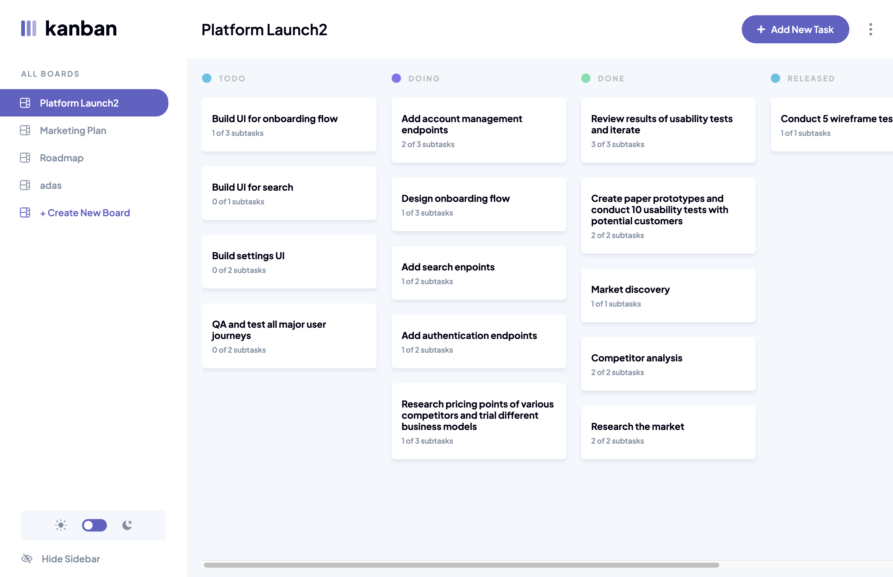

# Frontend Mentor - Kanban task management web app solution

This is a solution to the [Kanban task management web app challenge on Frontend Mentor](https://www.frontendmentor.io/challenges/kanban-task-management-web-app-wgQLt-HlbB). Frontend Mentor challenges help you improve your coding skills by building realistic projects.

## Table of contents

- [Overview](#overview)
    - [The challenge](#the-challenge)
    - [Screenshot](#screenshot)
    - [Links](#links)
- [My process](#my-process)
    - [Built with](#built-with)
    - [Continued development](#continued-development)
    - [Useful resources](#useful-resources)
- [Author](#author)
- [Acknowledgments](#acknowledgments)

## Overview

### The challenge

Users should be able to:

- View the optimal layout for the app depending on their device's screen size
- See hover states for all interactive elements on the page
- Create, read, update, and delete boards and tasks
- Receive form validations when trying to create/edit boards and tasks
- Mark subtasks as complete and move tasks between columns
- Hide/show the board sidebar
- Toggle the theme between light/dark modes
- **Bonus**: Allow users to drag and drop tasks to change their status and re-order them in a column
- **Bonus**: Keep track of any changes, even after refreshing the browser (`localStorage` could be used for this if you're not building out a full-stack app)
- **Bonus**: Build this project as a full-stack application

### Screenshot

### Links

- Solution URL: https://github.com/amjadsh97/kanban-task-management-web-app
- Live Site URL: https://kanban-task-management-web-app-lake.vercel.app/

## My process

### Built with

- Semantic HTML5 markup
- CSS custom properties
- Flexbox
- Vite.
- Typescript
- Redux
- [React](https://reactjs.org/) - JS library
- [React Router Dom](https://reactrouter.com/en/main) - JS library
- [Firebase](https://firebase.google.com/) - backend auth and storage
- [ant design](https://ant.design/components/overview/) - UI components.
- [Redux](https://redux.js.org/introduction/getting-started) - store management.

### Continued development

In the future, I will prioritize further developing my skills in making the user experience
more seamless and intuitive by focusing on responsive design principles. I aim to delve
deeper into backend development, especially database management and user authentication,
to enhance the functionality and security of the applications I build. Continuous learning and experimentation with new technologies will be crucial for
staying updated with industry trends and delivering cutting-edge solutions.

### Useful resources

- [React Docs](https://react.dev/) - This helped me for building react components. I really liked using this docs.

## Author

- Website - [Amjad Shadid](https://amjadshadid.com)
- Frontend Mentor - [@amjadsh97](https://www.frontendmentor.io/profile/amjadsh97)
- Twitter - [@Amjadshadid](https://twitter.com/Amjadshadid)
- Linkedin - [@Amjad Shadid](https://www.linkedin.com/in/amjad-shadid-134355134/)